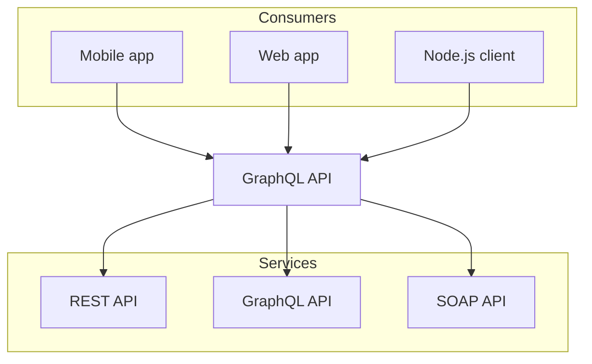

import { Bleed } from 'nextra/components';

# Introduction

**Nextra** is a [Next.js](https://nextjs.org) based static site generator.

It supports Markdown and React components ([MDX](/features/mdx)), automatically
generated [sidebar and anchor links](/get-started#sidebar-and-anchor-links),
file-system based routing, built-in syntax highlighting, image optimization,
custom layouts, i18n, and all the features you love about Next.js.

Here's what you will get in 1 minute:

<Bleed></Bleed>

`Tuple<Type?>` matches type constraint for tuple with elements of type `Type`

Parameter isn't required (default to `any`) in `Tuple`, but it can be parameterised with a type `Type` to constraint it
to a specified type (e.g. `number`):

```ts twoslash
// @errors: 2540
interface Todo {
  title: string;
}

const todo: Readonly<Todo> = {
  title: 'Delete inactive users'.toUpperCase(),
  //  ^?
};

todo.title = 'Hello';

Number.parseInt('123', 10);
//      ^|
// Just comments, so Popup will be
// not behind the viewport of `<code>`
// element due his `position: absolute` style
//
```

# Mermaid


